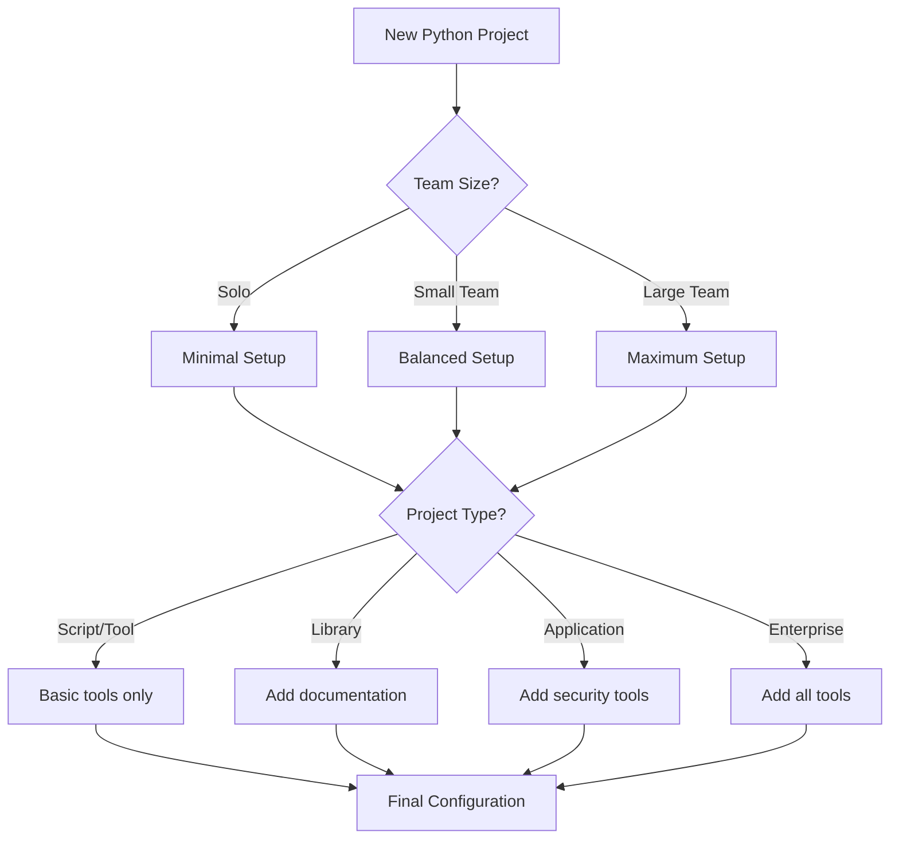

# Tool Selection Guide

This guide helps you choose the right tools for your Python project based on your specific needs, team size, and project type.

## Decision Matrix

### Project Type-Based Recommendations

| Project Type | Essential Tools | Recommended Tools | Optional Tools |
|--------------|----------------|-------------------|----------------|
| **Personal Script** | ruff, pytest | mypy, pre-commit | bandit, safety |
| **Open Source Library** | ruff, pytest, mypy, github-actions | pre-commit, coverage, mkdocs | bandit, safety, codecov |
| **Team Project** | ruff, pytest, mypy, pre-commit, github-actions | coverage, bandit, safety, mkdocs | tox, codecov, dependabot |
| **Enterprise/Production** | All quality tools | Documentation, CI/CD | Semantic release, advanced monitoring |

### Team Size Considerations

#### Solo Developer (1 person)
- **Start with**: ruff, pytest, basic GitHub Actions
- **Add gradually**: mypy, pre-commit, mkdocs
- **Avoid initially**: Complex CI/CD, enterprise tools

#### Small Team (2-5 people)
- **Essential**: ruff, pytest, mypy, pre-commit
- **Important**: GitHub Actions, coverage, basic documentation
- **Consider**: bandit, safety for security

#### Medium Team (6-20 people)
- **Required**: All quality tools, comprehensive CI/CD
- **Important**: Documentation, security scanning, dependency management
- **Consider**: Semantic release, advanced monitoring

#### Large Team/Enterprise (20+ people)
- **Required**: All tools, strict enforcement
- **Important**: Governance, compliance, advanced automation
- **Consider**: Custom tooling, enterprise integrations

## Tool Categories Deep Dive

### Code Quality (Essential for all projects)

#### Ruff (Highly Recommended)
**Choose when**:
- Any Python project
- Want fast linting and formatting
- Prefer modern, unified tooling

**Alternatives**:
- flake8 + black + isort (slower, more configuration)
- pylint (more detailed but slower)

#### MyPy (Recommended for most projects)
**Choose when**:
- Project will be maintained long-term
- Working in a team
- Want better IDE support
- Code correctness is important

**Skip when**:
- Very small scripts
- Prototype/experimental code
- Team unfamiliar with type hints

### Testing (Essential for all projects)

#### pytest (Highly Recommended)
**Choose when**:
- Any Python project needing tests
- Want modern testing features
- Need good plugin ecosystem

**Alternatives**:
- unittest (standard library, more verbose)
- nose2 (legacy, not recommended for new projects)

#### Coverage (Recommended for serious projects)
**Choose when**:
- Code quality is important
- Working in a team
- Need to track testing completeness

**Skip when**:
- Very early development stages
- Simple scripts
- Coverage would be misleading (e.g., lots of configuration code)

### Automation

#### Pre-commit (Recommended for team projects)
**Choose when**:
- Working with others
- Want to enforce code quality
- Need fast feedback loops

**Skip when**:
- Solo development with disciplined practices
- CI/CD covers all quality checks
- Hooks are too slow for workflow

#### GitHub Actions (Recommended for GitHub projects)
**Choose when**:
- Using GitHub
- Need automated testing
- Want free CI/CD

**Alternatives**:
- GitLab CI (for GitLab)
- Azure DevOps (for Microsoft ecosystem)
- Jenkins (for on-premise)

### Security

#### Bandit (Recommended for production code)
**Choose when**:
- Code will be deployed to production
- Handling sensitive data
- Security compliance is required

**Skip when**:
- Pure data science/research code
- Simple scripts with no security implications
- Learning/educational projects

#### Safety (Recommended for production code)
**Choose when**:
- Using third-party dependencies
- Security is a concern
- Need to track vulnerabilities

**Skip when**:
- Minimal dependencies
- Non-production code
- Dependencies are well-vetted and minimal

### Documentation

#### MkDocs vs Sphinx
**Choose MkDocs when**:
- Want easy setup and maintenance
- Team prefers Markdown
- Modern, clean appearance is important
- Simple to medium complexity documentation

**Choose Sphinx when**:
- Need advanced features (cross-references, multiple outputs)
- Want Python ecosystem standard
- Have complex API documentation needs
- Need PDF/EPUB output

### Advanced Tools

#### Tox (For library authors)
**Choose when**:
- Developing a library
- Need to test multiple Python versions
- Want standardized testing environments

**Skip when**:
- Application development
- Using Docker for environment isolation
- CI/CD handles multi-version testing

#### Nox (Alternative to Tox)
**Choose when**:
- Want Python-based configuration
- Need more flexibility than Tox
- Have complex testing scenarios

#### Docker (For applications)
**Choose when**:
- Developing applications (not libraries)
- Need consistent deployment environments
- Working with microservices

**Skip when**:
- Pure library development
- Simple scripts
- Team lacks Docker expertise

## Configuration Strategies

### Minimal Setup (Quick Start)
```json
{
    "use_ruff": "y",
    "use_mypy": "n",
    "use_pytest": "y",
    "use_coverage": "n",
    "use_pre_commit": "n",
    "use_bandit": "n",
    "use_safety": "n",
    "use_github_actions": "y",
    "use_mkdocs": "n"
}
```

**Pros**: Fast setup, minimal overhead
**Cons**: Limited quality assurance
**Best for**: Personal projects, prototypes, learning

### Balanced Setup (Recommended)
```json
{
    "use_ruff": "y",
    "use_mypy": "y",
    "use_pytest": "y",
    "use_coverage": "y",
    "use_pre_commit": "y",
    "use_bandit": "y",
    "use_safety": "y",
    "use_github_actions": "y",
    "use_mkdocs": "y"
}
```

**Pros**: Good quality/productivity balance
**Cons**: Some learning curve
**Best for**: Most professional projects

### Maximum Setup (Enterprise)
```json
{
    "use_ruff": "y",
    "use_mypy": "y",
    "use_pytest": "y",
    "use_coverage": "y",
    "use_pre_commit": "y",
    "use_bandit": "y",
    "use_safety": "y",
    "use_github_actions": "y",
    "use_dependabot": "y",
    "use_codecov": "y",
    "use_semantic_release": "y",
    "use_mkdocs": "y",
    "use_tox": "y",
    "use_docker": "y"
}
```

**Pros**: Maximum quality and automation
**Cons**: Complex setup, potential overhead
**Best for**: Critical applications, large teams

## Migration Strategies

### From Existing Project
1. **Assess current state**: What tools are you already using?
2. **Identify gaps**: What quality issues do you face?
3. **Incremental adoption**: Add tools one by one
4. **Team training**: Ensure everyone understands new tools

### Adding Tools Gradually
1. **Start with formatting**: Ruff (format only)
2. **Add linting**: Ruff (check)
3. **Add type checking**: MyPy with gradual mode
4. **Add automation**: Pre-commit hooks
5. **Add security**: Bandit and Safety
6. **Add advanced CI/CD**: Multiple Python versions, coverage

### Legacy Code Considerations
- **Use `# noqa` comments**: Temporarily ignore linting issues
- **Enable MyPy gradually**: Use `# type: ignore` comments
- **Exclude files**: Use tool configuration to exclude problematic files
- **Set baselines**: Use coverage and security baselines

## Common Pitfalls

### Over-tooling
**Problem**: Adding too many tools too quickly
**Solution**: Start minimal, add tools based on actual pain points

### Under-tooling
**Problem**: Skipping important quality tools
**Solution**: Include at least ruff, pytest, and basic CI

### Configuration Complexity
**Problem**: Over-configuring tools
**Solution**: Start with defaults, customize only when needed

### Team Resistance
**Problem**: Team pushback on new tools
**Solution**: Gradual introduction, clear value demonstration

### Performance Issues
**Problem**: Tools slowing down development
**Solution**: Optimize configurations, use faster alternatives (like Ruff)

## Tool Compatibility Matrix

| Tool 1 | Tool 2 | Compatibility | Notes |
|--------|--------|---------------|-------|
| Ruff | MyPy | ✅ Excellent | Ruff handles formatting, MyPy handles types |
| Ruff | Black | ⚠️ Conflict | Ruff replaces Black - don't use both |
| pytest | Coverage | ✅ Excellent | Standard combination |
| Bandit | Safety | ✅ Excellent | Complementary security tools |
| Tox | Nox | ⚠️ Alternative | Choose one - both serve similar purposes |
| MkDocs | Sphinx | ⚠️ Alternative | Choose based on needs |

## Decision Flowchart



## Getting Help

### Learning Resources
- **Tool documentation**: Each tool has excellent documentation
- **Community examples**: GitHub repos using these tools
- **Tutorials**: Python packaging guides and tutorials

### Common Questions
- **"Too many tools?"**: Start minimal, add based on needs
- **"Which formatter?"**: Use Ruff for new projects
- **"MkDocs vs Sphinx?"**: MkDocs for most projects, Sphinx for complex needs
- **"CI/CD platform?"**: GitHub Actions for GitHub, others for different platforms

This guide should help you make informed decisions about tool selection based on your specific project needs and constraints.
